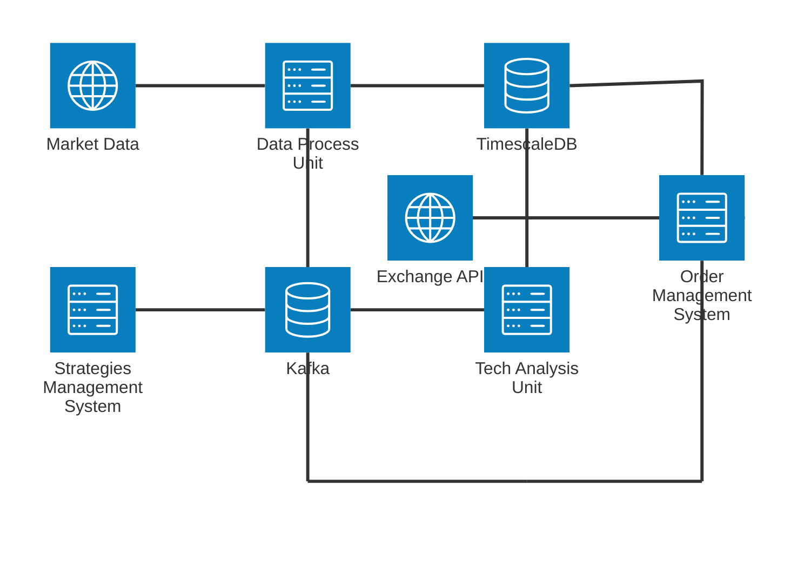

# Quantari

Receives Market Data from Binance for a Given Symbol,
and process the information base on multiple strategy that result in order execution

## 📌 Disclaimer

This software was made for educational purpose and it's not tested with live data

There is no guarantee that this software will work flawlessly at this or later
times. Of course, no responsibility is taken for possible profits or losses.
This software probably has some errors in it, so use it at your own risk. Also
no one should be motivated or tempted to invest assets in speculative forms of
investment. By using this software you release the author(s) from any liability
regarding the use of this software.
